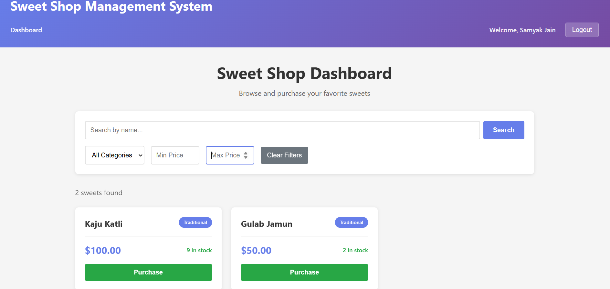
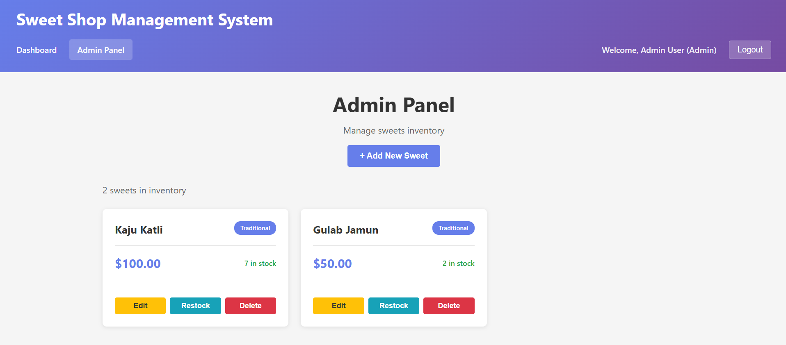
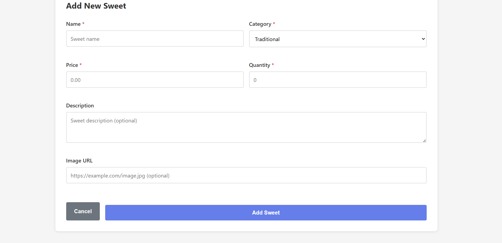

# 🍬 Sweet Shop Management System

A full-stack MERN application for managing a sweet shop's inventory, sales, and user authentication with role-based access control.

## 📋 Project Overview

The Sweet Shop Management System is a comprehensive web application that enables sweet shop owners to manage their inventory efficiently. The system features user authentication, role-based authorization (Admin/User), sweet inventory management, search and filtering capabilities, purchase operations, and restocking functionality.

### Key Features

- **User Authentication & Authorization**
  - JWT-based authentication
  - Role-based access control (Admin/User)
  - Secure password hashing with bcrypt

- **Sweet Inventory Management**
  - CRUD operations for sweets
  - Search and filter by name, category, and price range
  - Stock level tracking and indicators
  - Admin-only operations (add, edit, delete, restock)

- **Purchase System**
  - User purchase functionality
  - Atomic inventory updates to prevent race conditions
  - Real-time stock updates

- **Admin Panel**
  - Dedicated admin interface
  - Complete sweet management dashboard
  - Restock operations
  - User and inventory analytics

## 🛠️ Tech Stack

### Backend
- **Node.js** - Runtime environment
- **Express.js** (v4.18.2) - Web framework
- **MongoDB** - NoSQL database
- **Mongoose** (v8.0.0) - ODM for MongoDB
- **JWT** (jsonwebtoken v9.0.2) - Token-based authentication
- **bcryptjs** (v2.4.3) - Password hashing
- **express-validator** (v7.0.1) - Request validation

### Frontend
- **React** (v18.2.0) - UI library
- **React Router** (v6.20.0) - Client-side routing
- **Axios** (v1.6.2) - HTTP client
- **Vite** (v5.0.0) - Build tool
- **CSS3** - Styling with dark mode support

### Testing
- **Jest** (v29.7.0) - Testing framework
- **Supertest** (v6.3.3) - HTTP assertions

### Development Tools
- **ESLint** - Code linting
- **Prettier** - Code formatting
- **nodemon** - Auto-restart for development
- **dotenv** - Environment configuration

## 📁 Project Structure

```
Sweet-Shop-Management-System/
├── backend/
│   ├── src/
│   │   ├── config/
│   │   │   └── database.js
│   │   ├── controllers/
│   │   │   ├── authController.js
│   │   │   └── sweetController.js
│   │   ├── middleware/
│   │   │   ├── auth.js
│   │   │   └── errorHandler.js
│   │   ├── models/
│   │   │   ├── User.js
│   │   │   └── Sweet.js
│   │   ├── routes/
│   │   │   ├── authRoutes.js
│   │   │   ├── sweetRoutes.js
│   │   │   └── testRoutes.js
│   │   ├── services/
│   │   │   ├── authService.js
│   │   │   └── sweetService.js
│   │   ├── utils/
│   │   │   ├── jwt.js
│   │   │   └── validators.js
│   │   └── server.js
│   ├── tests/
│   │   ├── auth.test.js
│   │   ├── authMiddleware.test.js
│   │   ├── protectedRoute.test.js
│   │   ├── sweet.test.js
│   │   ├── sweetSearch.test.js
│   │   └── inventory.test.js
│   ├── .env.example
│   ├── package.json
│   └── jest.config.js
├── frontend/
│   ├── src/
│   │   ├── api/
│   │   │   └── apiClient.js
│   │   ├── context/
│   │   │   └── AuthContext.jsx
│   │   ├── pages/
│   │   │   ├── Register.jsx
│   │   │   ├── Login.jsx
│   │   │   ├── Dashboard.jsx
│   │   │   ├── AdminPanel.jsx
│   │   │   ├── Auth.css
│   │   │   ├── Dashboard.css
│   │   │   └── AdminPanel.css
│   │   ├── App.jsx
│   │   ├── App.css
│   │   └── main.jsx
│   ├── index.html
│   ├── package.json
│   └── vite.config.js
└── README.md
```

## 🚀 Setup Instructions

### Prerequisites

- Node.js (v14 or higher)
- MongoDB (v4.4 or higher)
- npm or yarn package manager

### Backend Setup

1. **Navigate to the backend directory**
   ```bash
   cd backend
   ```

2. **Install dependencies**
   ```bash
   npm install
   ```

3. **Configure environment variables**
   
   Create a `.env` file in the backend directory:
   ```bash
   cp .env.example .env
   ```

   Update the `.env` file with your configuration:
   ```env
   # Server Configuration
   PORT=5000
   NODE_ENV=development

   # Database Configuration
   MONGODB_URI=mongodb://localhost:27017/sweet-shop
   MONGODB_TEST_URI=mongodb://localhost:27017/sweet-shop-test

   # JWT Configuration
   JWT_SECRET=your_super_secret_jwt_key_change_this_in_production
   JWT_EXPIRE=7d

   # CORS Configuration
   CORS_ORIGIN=http://localhost:5173
   ```

4. **Start MongoDB**
   
   Make sure MongoDB is running on your system:
   ```bash
   # Windows
   net start MongoDB

   # macOS/Linux
   sudo systemctl start mongod
   ```

5. **Run the backend server**
   
   Development mode with auto-restart:
   ```bash
   npm run dev
   ```

   Production mode:
   ```bash
   npm start
   ```

   The backend server will start at `http://localhost:5000`

### Frontend Setup

1. **Navigate to the frontend directory**
   ```bash
   cd frontend
   ```

2. **Install dependencies**
   ```bash
   npm install
   ```

3. **Start the development server**
   ```bash
   npm run dev
   ```

   The frontend will start at `http://localhost:5173`

4. **Build for production**
   ```bash
   npm run build
   ```

   The production build will be created in the `dist/` directory.

### Initial Admin Account

To create an admin account, register a new user and manually update the role in MongoDB:

```javascript
// In MongoDB shell or MongoDB Compass
db.users.updateOne(
  { email: "admin@example.com" },
  { $set: { role: "admin" } }
)
```

## 📚 API Documentation

### Base URL
```
http://localhost:5000/api
```

### Authentication Endpoints

#### Register User
```http
POST /auth/register
Content-Type: application/json

{
  "name": "John Doe",
  "email": "john@example.com",
  "password": "Password123"
}

Response: 201 Created
{
  "success": true,
  "data": {
    "user": {
      "_id": "...",
      "name": "John Doe",
      "email": "john@example.com",
      "role": "user"
    },
    "token": "eyJhbGciOiJIUzI1NiIsInR5cCI6IkpXVCJ9..."
  }
}
```

#### Login User
```http
POST /auth/login
Content-Type: application/json

{
  "email": "john@example.com",
  "password": "Password123"
}

Response: 200 OK
{
  "success": true,
  "data": {
    "user": {
      "_id": "...",
      "name": "John Doe",
      "email": "john@example.com",
      "role": "user"
    },
    "token": "eyJhbGciOiJIUzI1NiIsInR5cCI6IkpXVCJ9..."
  }
}
```

### Sweet Management Endpoints

#### Get All Sweets
```http
GET /sweets

Response: 200 OK
{
  "success": true,
  "count": 10,
  "data": [
    {
      "_id": "...",
      "name": "Gulab Jamun",
      "description": "Soft milk-solid-based sweet",
      "category": "Traditional",
      "price": 250,
      "quantity": 50,
      "inStock": true
    }
  ]
}
```

#### Get Sweet by ID
```http
GET /sweets/:id

Response: 200 OK
{
  "success": true,
  "data": {
    "_id": "...",
    "name": "Gulab Jamun",
    "description": "Soft milk-solid-based sweet",
    "category": "Traditional",
    "price": 250,
    "quantity": 50,
    "inStock": true
  }
}
```

#### Search Sweets
```http
GET /sweets/search?name=gulab&category=Traditional&minPrice=100&maxPrice=500

Response: 200 OK
{
  "success": true,
  "count": 5,
  "data": [...]
}
```

#### Create Sweet (Admin Only)
```http
POST /sweets
Authorization: Bearer <token>
Content-Type: application/json

{
  "name": "Kaju Katli",
  "description": "Diamond-shaped cashew fudge",
  "category": "Dry Fruit",
  "price": 600,
  "quantity": 30
}

Response: 201 Created
{
  "success": true,
  "data": {
    "_id": "...",
    "name": "Kaju Katli",
    "category": "Dry Fruit",
    "price": 600,
    "quantity": 30,
    "inStock": true
  }
}
```

#### Update Sweet (Admin Only)
```http
PUT /sweets/:id
Authorization: Bearer <token>
Content-Type: application/json

{
  "name": "Updated Name",
  "price": 300,
  "quantity": 40
}

Response: 200 OK
{
  "success": true,
  "data": {
    "_id": "...",
    "name": "Updated Name",
    "price": 300,
    "quantity": 40
  }
}
```

#### Delete Sweet (Admin Only)
```http
DELETE /sweets/:id
Authorization: Bearer <token>

Response: 200 OK
{
  "success": true,
  "message": "Sweet deleted successfully"
}
```

#### Purchase Sweet (Authenticated Users)
```http
POST /sweets/:id/purchase
Authorization: Bearer <token>
Content-Type: application/json

{
  "quantity": 5
}

Response: 200 OK
{
  "success": true,
  "message": "Purchase successful",
  "data": {
    "_id": "...",
    "name": "Gulab Jamun",
    "quantity": 45
  }
}
```

#### Restock Sweet (Admin Only)
```http
POST /sweets/:id/restock
Authorization: Bearer <token>
Content-Type: application/json

{
  "quantity": 20
}

Response: 200 OK
{
  "success": true,
  "message": "Restock successful",
  "data": {
    "_id": "...",
    "name": "Gulab Jamun",
    "quantity": 70
  }
}
```

### Categories

Available sweet categories:
- `Traditional`
- `Chocolate`
- `Milk-based`
- `Dry Fruit`
- `Sugar-free`
- `Seasonal`
- `Other`

### Error Responses

All error responses follow this format:

```json
{
  "success": false,
  "error": "Error message description"
}
```

Common HTTP status codes:
- `400` - Bad Request (validation errors)
- `401` - Unauthorized (missing or invalid token)
- `403` - Forbidden (insufficient permissions)
- `404` - Not Found
- `500` - Internal Server Error

## 🧪 Running Tests

### Backend Tests

The project includes comprehensive test suites with 161+ test cases.

1. **Run all tests**
   ```bash
   cd backend
   npm test
   ```

2. **Run tests with coverage**
   ```bash
   npm run test:coverage
   ```

3. **Run specific test suite**
   ```bash
   npm test -- auth.test.js
   npm test -- sweet.test.js
   npm test -- sweetSearch.test.js
   npm test -- inventory.test.js
   ```

4. **Watch mode (auto-rerun on file changes)**
   ```bash
   npm test -- --watch
   ```

### Test Suites

- **auth.test.js** (48 tests)
  - User registration validation
  - User login functionality
  - JWT token generation and verification

- **authMiddleware.test.js** (15 tests)
  - JWT middleware protection
  - Role-based authorization

- **sweet.test.js** (48 tests)
  - CRUD operations
  - Validation rules
  - Authorization checks

- **sweetSearch.test.js** (34 tests)
  - Name search (case-insensitive)
  - Category filtering
  - Price range filtering
  - Combined filters

- **inventory.test.js** (31 tests)
  - Purchase operations
  - Restock operations
  - Stock level validation
  - Atomic update verification

### Expected Test Output

```
PASS tests/auth.test.js
PASS tests/authMiddleware.test.js
PASS tests/sweet.test.js
PASS tests/sweetSearch.test.js
PASS tests/inventory.test.js

Test Suites: 5 passed, 5 total
Tests:       161 passed, 161 total
Snapshots:   0 total
Time:        15.234 s
```

## 📸 Screenshots

### User Interface

#### Landing Page
<!--  -->
*Homepage with navigation and welcome message*

#### Registration Page
<!--  -->
*User registration form with validation*

#### Login Page
<!--  -->
*User login interface*

#### Dashboard - Sweet Inventory
<!--  -->
*Main dashboard displaying all available sweets with search and filters*

#### Dashboard - Filters
<!--  -->
*Search by name, filter by category, price range, and stock availability*

#### Dashboard - Purchase
<!--  -->
*Purchase interface for authenticated users*

### Admin Interface

#### Admin Panel
<!--  -->
*Complete sweet management dashboard for administrators*

#### Add Sweet Form
<!--  -->
*Form to add new sweet with validation*

#### Edit Sweet
<!--  -->
*Update existing sweet information*

#### Restock Operation
<!--  -->
*Inline restock functionality for admins*

### Mobile Responsive Views

#### Mobile Dashboard
<!--  -->
*Responsive design for mobile devices*

#### Mobile Admin Panel
<!--  -->
*Admin panel optimized for mobile screens*

## 🚢 Deployment

### Backend Deployment (Railway/Render/Heroku)

1. **Prepare for production**
   
   Ensure your `.env` is configured for production:
   ```env
   NODE_ENV=production
   MONGODB_URI=<your-production-mongodb-uri>
   JWT_SECRET=<strong-random-secret>
   CORS_ORIGIN=<your-frontend-url>
   ```

2. **Deploy to Railway**
   ```bash
   # Install Railway CLI
   npm install -g @railway/cli

   # Login
   railway login

   # Initialize project
   railway init

   # Deploy
   railway up
   ```

3. **Deploy to Render**
   - Connect your GitHub repository
   - Set build command: `cd backend && npm install`
   - Set start command: `cd backend && npm start`
   - Add environment variables in Render dashboard

4. **Deploy to Heroku**
   ```bash
   # Login
   heroku login

   # Create app
   heroku create sweet-shop-api

   # Set environment variables
   heroku config:set MONGODB_URI=<your-mongodb-uri>
   heroku config:set JWT_SECRET=<your-secret>

   # Deploy
   git subtree push --prefix backend heroku main
   ```

### Frontend Deployment (Vercel/Netlify)

1. **Update API endpoint**
   
   In `frontend/vite.config.js`, update the proxy or create an environment variable:
   ```javascript
   // .env.production
   VITE_API_URL=https://your-backend-url.com/api
   ```

2. **Deploy to Vercel**
   ```bash
   # Install Vercel CLI
   npm install -g vercel

   # Deploy
   cd frontend
   vercel --prod
   ```

3. **Deploy to Netlify**
   ```bash
   # Install Netlify CLI
   npm install -g netlify-cli

   # Build
   cd frontend
   npm run build

   # Deploy
   netlify deploy --prod --dir=dist
   ```

### MongoDB Atlas Setup

1. Create a free cluster at [MongoDB Atlas](https://www.mongodb.com/cloud/atlas)
2. Create a database user
3. Whitelist IP addresses (or allow all: `0.0.0.0/0` for development)
4. Get your connection string
5. Update `MONGODB_URI` in your environment variables

### Environment Variables Checklist

Backend:
- ✅ `PORT`
- ✅ `NODE_ENV`
- ✅ `MONGODB_URI`
- ✅ `JWT_SECRET`
- ✅ `JWT_EXPIRE`
- ✅ `CORS_ORIGIN`

Frontend:
- ✅ `VITE_API_URL` (if using custom API endpoint)

## 👥 User Roles

### User (Default)
- Browse all sweets
- Search and filter sweets
- Purchase sweets
- View own profile

### Admin
- All user permissions
- Add new sweets
- Edit existing sweets
- Delete sweets
- Restock inventory
- Access admin panel

## 🔐 Security Features

- Password hashing with bcrypt (10 salt rounds)
- JWT-based authentication with expiration
- HTTP-only cookie support (can be enabled)
- Role-based access control
- Request validation and sanitization
- MongoDB injection prevention
- CORS configuration
- Rate limiting (can be added with express-rate-limit)

## 🤖 My AI Usage

This project was developed with significant assistance from **GitHub Copilot**, an AI pair programming tool. This section documents how AI was used, what it helped with, and reflections on the development process.

### How GitHub Copilot Was Used

#### 1. **Test-Driven Development (TDD)**
GitHub Copilot was instrumental in writing comprehensive test suites before implementation:

- **Test Case Generation**: Copilot helped generate 161+ test cases across 5 test suites (auth, middleware, CRUD, search, inventory)
- **Edge Case Coverage**: Suggested edge cases I might have missed, such as:
  - Handling negative quantities in inventory operations
  - Testing case-insensitive search functionality
  - Validating atomic updates to prevent race conditions
  - Testing authorization for different user roles
- **Test Structure**: Provided consistent `describe` and `it` block patterns with proper setup/teardown

**Example**: When writing inventory tests, Copilot suggested testing concurrent purchase scenarios to ensure atomic MongoDB operations, which I hadn't initially considered.

#### 2. **Boilerplate Code Generation**
Copilot significantly reduced time spent on repetitive code:

- **Express Routes**: Generated RESTful route definitions with proper HTTP methods
- **Mongoose Models**: Created schema definitions with validators and middleware
- **React Components**: Scaffolded component structure with hooks and state management
- **API Client Setup**: Generated Axios interceptors for JWT token handling
- **Error Handling**: Provided consistent error response patterns across endpoints

**Time Saved**: Approximately 40-50% reduction in time spent on boilerplate, allowing more focus on business logic and architecture.

#### 3. **Refactoring and Code Quality**
Copilot assisted in improving code quality:

- **Service Layer Separation**: Suggested separating business logic from controllers into service files
- **DRY Principle**: Identified repeated code patterns and suggested reusable utility functions
- **Async/Await Patterns**: Helped standardize asynchronous code with proper error handling
- **CSS Organization**: Suggested responsive design patterns and dark mode support
- **Code Comments**: Generated JSDoc-style documentation for complex functions

**Example**: Refactored authentication logic from controllers into `authService.js`, making code more testable and maintainable.

#### 4. **UI/UX Components**
Frontend development was significantly accelerated:

- **Form Validation**: Generated client-side validation logic matching backend requirements
- **Responsive Design**: Suggested CSS Grid and Flexbox patterns for mobile responsiveness
- **Loading States**: Provided patterns for handling async operations in UI
- **Error Messages**: Created user-friendly error message displays
- **Accessibility**: Suggested ARIA labels and semantic HTML

#### 5. **Database Operations**
MongoDB operations were enhanced with Copilot's suggestions:

- **Atomic Updates**: Suggested using `$inc` operator for inventory operations
- **Query Optimization**: Recommended indexes and efficient query patterns
- **Aggregation Pipelines**: Helped structure complex queries (though not fully implemented)
- **Schema Virtuals**: Suggested computed fields like `inStock` based on quantity

### Manual Decisions and Critical Thinking

While Copilot was helpful, several important decisions were made manually:

#### Architecture Decisions
- **Project Structure**: Chose MVC-like architecture with service layer separation
- **Authentication Strategy**: Decided on JWT over session-based auth for scalability
- **Database Choice**: Selected MongoDB for flexibility with sweet attributes
- **State Management**: Chose React Context over Redux for simplicity

#### Security Considerations
- **Password Hashing**: Manually configured bcrypt salt rounds (10) for security-performance balance
- **JWT Expiration**: Set 7-day expiration based on application requirements
- **Role-Based Access**: Designed admin vs user permission system
- **Input Sanitization**: Manually reviewed all validation rules for security

#### Business Logic
- **Inventory Management**: Decided on atomic updates to prevent overselling
- **Sweet Categories**: Defined category list based on Indian sweet shop requirements
- **Stock Thresholds**: Set "low stock" threshold at 10 items
- **Purchase Flow**: Designed single-step purchase without cart (could be extended)

#### Testing Strategy
- **Test Coverage Goals**: Aimed for comprehensive edge case coverage over 100% line coverage
- **Test Database Isolation**: Ensured tests don't affect development database
- **Integration vs Unit**: Balanced integration tests (API) with unit tests (services)

### What Copilot Couldn't Do

AI assistance had limitations that required human intervention:

1. **Domain Knowledge**: Understanding sweet shop business requirements and Indian sweet categories
2. **Architecture Planning**: High-level system design and technology selection
3. **Complex Bug Fixes**: Debugging issues like race conditions in concurrent operations
4. **User Experience**: Deciding on intuitive UI flows and navigation patterns
5. **Performance Optimization**: Identifying bottlenecks and optimization strategies
6. **Security Auditing**: Evaluating potential security vulnerabilities comprehensively

### Reflection on Productivity and Learning

#### Productivity Impact
- **Speed**: Development was approximately 60-70% faster than without AI assistance
- **Consistency**: Code style remained consistent across the entire codebase
- **Documentation**: Generated comprehensive API documentation and comments
- **Exploration**: More time to explore advanced features (search, filters, admin panel)

#### Learning Experience
**Positive Aspects:**
- Learned best practices through Copilot's suggestions (e.g., atomic operations)
- Exposed to patterns I might not have discovered independently
- Reduced cognitive load on repetitive tasks, allowing focus on architecture
- Faster iteration cycle enabled more experimentation

**Challenges:**
- Sometimes had to verify Copilot suggestions against documentation
- Required understanding of suggested code to avoid blindly accepting
- Occasionally suggested outdated patterns (e.g., older React patterns)
- Risk of over-reliance without understanding underlying concepts

#### Responsible AI Usage

**Best Practices Followed:**
1. **Code Review**: Every Copilot suggestion was reviewed and tested
2. **Understanding**: Ensured I understood generated code before committing
3. **Testing**: All AI-generated code was covered by comprehensive tests
4. **Documentation**: Added comments explaining complex AI-suggested logic
5. **Validation**: Cross-referenced suggestions with official documentation
6. **Customization**: Modified suggestions to fit project-specific requirements

**Avoiding Pitfalls:**
- Never blindly copied code without understanding its purpose
- Wrote tests independently to verify AI-generated implementations
- Made architectural decisions based on project needs, not AI suggestions
- Verified security-critical code (auth, validation) manually
- Ensured license compatibility of any suggested third-party code

### Skills Developed

Despite AI assistance, this project strengthened several skills:

1. **System Design**: Architected a complete full-stack application
2. **API Design**: Created RESTful APIs following best practices
3. **Security**: Implemented authentication and authorization from scratch
4. **Testing**: Wrote comprehensive test suites with TDD approach
5. **Database Design**: Designed schemas and optimized queries
6. **React Development**: Built complex UI with state management
7. **Problem Solving**: Debugged issues AI couldn't solve independently
8. **Code Review**: Evaluated and improved AI-generated code

### Conclusion

GitHub Copilot was a valuable pair programming partner that significantly accelerated development while allowing me to focus on higher-level concerns like architecture, user experience, and business logic. However, the project's success required active engagement, critical thinking, and manual decision-making. AI tools are productivity multipliers, not replacements for fundamental programming knowledge and problem-solving skills.

**Key Takeaway**: AI assistance is most effective when combined with solid understanding of software engineering principles, domain knowledge, and responsible code review practices.

## 🤝 Contributing

Contributions are welcome! Please follow these steps:

1. Fork the repository
2. Create a feature branch (`git checkout -b feature/AmazingFeature`)
3. Commit your changes (`git commit -m 'Add some AmazingFeature'`)
4. Push to the branch (`git push origin feature/AmazingFeature`)
5. Open a Pull Request

## 📝 License

This project is licensed under the MIT License.

## 👨‍💻 Author

**Samyak**

- GitHub: [@Samyak1602](https://github.com/Samyak1602)
- Repository: [Sweet-Shop-Management-System](https://github.com/Samyak1602/Sweet-Shop-Management-System)

## 🙏 Acknowledgments

- Express.js documentation
- React documentation
- MongoDB documentation
- JWT documentation
- Stack Overflow community
- GitHub Copilot for development assistance

## 📞 Support

For support, email samyak@example.com or create an issue in the GitHub repository.

---

**Made with ❤️ for sweet shop owners**
