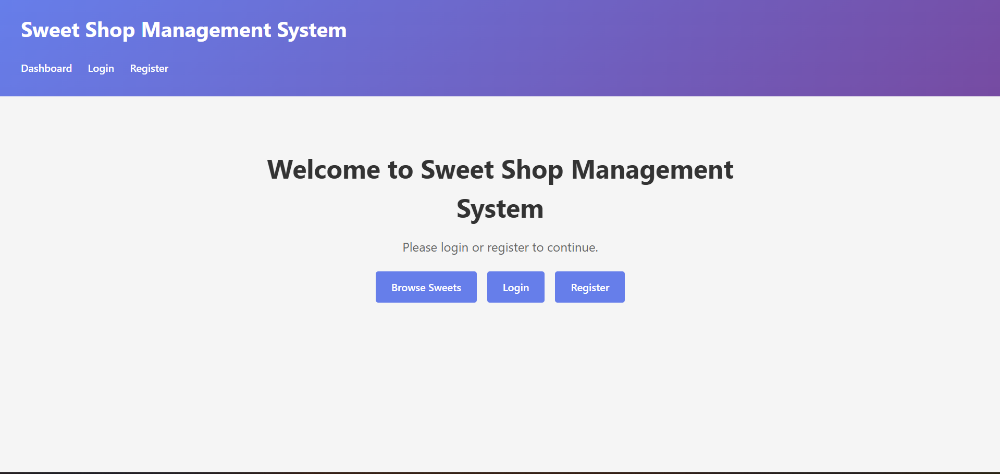
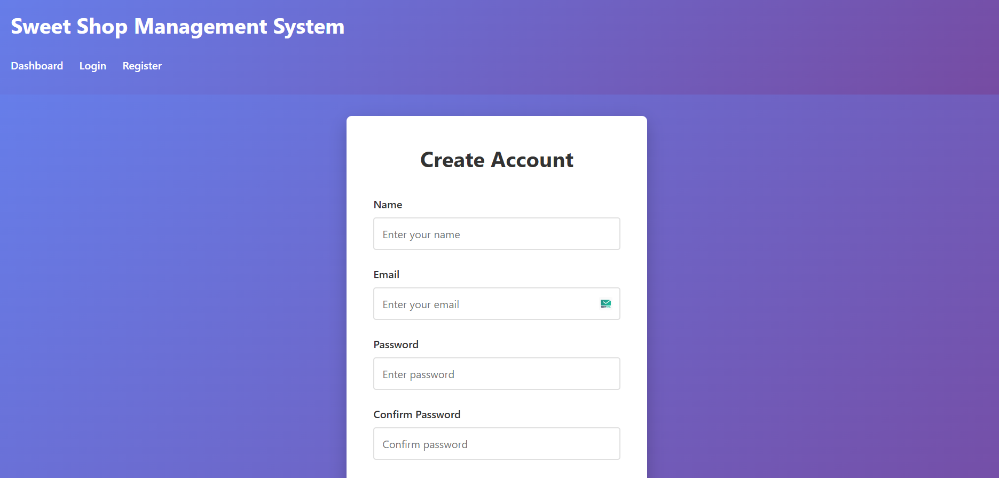

# Sweet Shop Management System

A full-stack MERN application for managing a sweet shop business.

## Tech Stack

### Backend
- Node.js
- Express.js
- MongoDB with Mongoose
- JWT Authentication
- Express Validator

### Frontend
- React 18
- Vite
- React Router
- Axios

## Project Structure

```
Sweet-Shop-Management-System/
├── backend/
│   ├── src/
│   │   ├── config/         # Database and app configuration
│   │   ├── controllers/    # Request handlers
│   │   ├── middleware/     # Custom middleware (auth, error handling)
│   │   ├── models/         # Mongoose schemas
│   │   ├── routes/         # API routes
│   │   ├── services/       # Business logic layer
│   │   ├── utils/          # Helper functions
│   │   └── server.js       # Entry point
│   ├── tests/              # Test files
│   └── package.json
│
├── frontend/
│   ├── src/
│   │   ├── api/           # API client configuration
│   │   ├── assets/        # Static assets
│   │   ├── components/    # Reusable React components
│   │   ├── context/       # React context for state management
│   │   ├── hooks/         # Custom React hooks
│   │   ├── pages/         # Page components
│   │   ├── utils/         # Helper functions
│   │   ├── App.jsx        # Root component
│   │   └── main.jsx       # Entry point
│   └── package.json
│
└── README.md
```

## Getting Started

### Prerequisites
- Node.js (v18 or higher)
- MongoDB (local installation or MongoDB Atlas)
- npm or yarn

### Installation

1. Clone the repository:
```bash
git clone <repository-url>
cd Sweet-Shop-Management-System
```

2. Set up the backend:
```bash
cd backend
npm install
cp .env.example .env
# Edit .env with your configuration
```

3. Set up the frontend:
```bash
cd frontend
npm install
cp .env.example .env
# Edit .env with your configuration
```

### Running the Application

1. Start MongoDB (if running locally)

2. Start the backend server:
```bash
cd backend
npm run dev
```

3. Start the frontend development server:
```bash
cd frontend
npm run dev
```

4. Open your browser and navigate to `http://localhost:5173`

## Development

### Backend Development
- API runs on `http://localhost:5000`
- See `backend/README.md` for detailed backend documentation

### Frontend Development
- App runs on `http://localhost:5173`
- See `frontend/README.md` for detailed frontend documentation

## Code Quality

Both backend and frontend include:
- ESLint for code linting
- Prettier for code formatting

Run linting:
```bash
npm run lint
```

Fix linting issues:
```bash
npm run lint:fix
```

Format code:
```bash
npm run format
```

## API Endpoints

### Authentication
- `POST /api/auth/register` - Register a new user
- `POST /api/auth/login` - Login user

### Sweets (Protected - Requires Authentication)
- `GET /api/sweets` - Get all sweets (supports query params: name, category, minPrice, maxPrice)
- `GET /api/sweets/search` - Search sweets by name, category, or price range
- `GET /api/sweets/:id` - Get a single sweet by ID
- `POST /api/sweets` - Create a new sweet (Admin only)
- `PUT /api/sweets/:id` - Update a sweet (Admin only)
- `DELETE /api/sweets/:id` - Delete a sweet (Admin only)
- `POST /api/sweets/:id/purchase` - Purchase a sweet (decreases quantity)
- `POST /api/sweets/:id/restock` - Restock a sweet (increases quantity, Admin only)

## Features

### User Features
- User registration and login with JWT authentication
- Browse all available sweets
- Search sweets by name, category, or price range
- Purchase sweets (decreases inventory)
- View sweet details including price and stock quantity

### Admin Features
- All user features plus:
- Add new sweets to inventory
- Edit existing sweets
- Delete sweets
- Restock sweets (increase inventory)
- Access to admin panel

## Screenshots

### Homepage

*Welcome page with navigation to login, register, or browse sweets*

### User Registration

*User registration form with validation*

### User Login

*Login page for authenticated users*

### Dashboard - Sweets Listing

*Main dashboard showing all available sweets with search and filter options*

### Admin Panel

*Admin panel for managing sweets inventory*

### Add/Edit Sweet Form

*Form for adding or editing sweets with all required fields*

## Testing

Backend includes Jest for testing:
```bash
cd backend
npm test
```

## Environment Variables

### Backend (.env)
```env
MONGODB_URI=mongodb://localhost:27017/sweet-shop
PORT=5000
CORS_ORIGIN=http://localhost:5173
JWT_SECRET=your_super_secret_jwt_key
JWT_EXPIRE=7d
NODE_ENV=development
```

### Frontend (.env)
```env
VITE_API_URL=http://localhost:5000/api
```

## My AI Usage

### AI Tools Used
- **GitHub Copilot** - Primary AI assistant used throughout the development process

### How AI Was Used

1. **Initial Project Setup**: Used GitHub Copilot to generate boilerplate code for the project structure, including Express server setup, React component templates, and configuration files.

2. **Backend Development**:
   - Generated service layer functions for sweet management (CRUD operations, purchase, restock)
   - Created controller functions with proper error handling patterns
   - Generated route definitions with authentication and authorization middleware
   - Assisted with Mongoose schema definitions and model methods

3. **Frontend Development**:
   - Generated React components for Dashboard and AdminPanel
   - Created form handling logic with validation
   - Assisted with API integration using Axios
   - Generated CSS styling for responsive design

4. **Code Quality**:
   - Used Copilot suggestions for consistent code patterns
   - Generated error handling and validation logic
   - Assisted with async/await patterns and promise handling

5. **Debugging**:
   - Used Copilot to identify and fix response format mismatches between backend and frontend
   - Assisted with fixing authentication flow issues
   - Helped resolve routing and component import issues

### Reflection on AI Impact

The use of GitHub Copilot significantly accelerated the development process by:
- **Reducing boilerplate code**: Copilot quickly generated repetitive code structures, allowing focus on business logic
- **Consistency**: Helped maintain consistent coding patterns across the codebase
- **Learning**: Provided examples of best practices for Express.js, React, and MongoDB integration
- **Error Prevention**: Suggested proper error handling patterns and validation logic

However, it was crucial to:
- **Review all generated code**: Not all suggestions were perfect and required manual review and refinement
- **Understand the code**: Rather than blindly accepting suggestions, I ensured I understood what each piece of code does
- **Test thoroughly**: AI-generated code still required comprehensive testing to ensure it works correctly
- **Maintain architecture**: Used AI as a tool to implement the planned architecture, not to design it

The AI tool was most valuable for generating repetitive code patterns and providing quick solutions to common problems, but the overall architecture, design decisions, and final implementation quality were the result of careful planning and manual refinement.

## Contributing

1. Create a feature branch
2. Make your changes
3. Run linting and tests
4. Submit a pull request

## License

ISC
